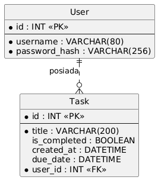

# TodoList

A simple task management application.

## Technologies

* **Backend:** Python, Flask, SQLAlchemy, Flask-JWT-Extended
* **Frontend:** Next.js
* **Database:** PostgreSQL 15
* **Containerization:** Docker

## Setup Instructions

Follow these steps to run the project locally:

1.  **Prerequisites**
    Ensure you have Docker installed on your machine.

2.  **Environment Configuration**
    Create a `.env` file in the main project directory and define the database credentials (required by the configuration in `docker-compose.yml`):

    ```text
    POSTGRES_USER=user
    POSTGRES_PASSWORD=password
    POSTGRES_DB=db
    ```

3.  **Build and Run**
    Run the following command in the terminal within the main project directory:

    ```bash
    docker-compose up --build
    ```

4.  **Accessing the Application**
    Once the containers are successfully built and running, the services will be available at:
    * Frontend: http://localhost:3000
    * Backend API: http://localhost:5000

## Project Structure

* **backend/** - Source code for the Flask API server.
* **frontend/** - Source code for the Next.js client application.
* **docker-compose.yml** - Service orchestration file (frontend, backend, database).

## Database Schema

